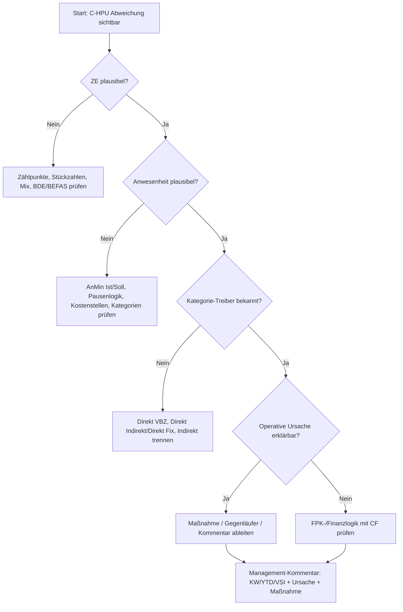

# C-HPU – vollständige Wissens- und Berechnungsdokumentation

**Stand:** 10.06.2026  
**Kontext:** Volkswagen Group Components / Industrial Engineering  
**Ziel dieses Dokuments:** Dieses Markdown-Dokument erklärt C-HPU fachlich, methodisch und rechnerisch so, dass die Kennzahl nicht nur „bedient“, sondern in der Tiefe verstanden, plausibilisiert, interpretiert und für Analysen genutzt werden kann.

> **Kurzdefinition:** C-HPU steht für **Components Hours Per Unit**. Sie beschreibt, wie viele relevante **Netto-Anwesenheitsminuten** pro **standardisierter Zähleinheit** eingesetzt werden. Die Kennzahl ist damit eine Zeit-pro-Leistung-Kennzahl und dient der Produktivitätssteuerung.

---

## 1. Executive Summary

C-HPU beantwortet im Kern die Frage:

> **Wie viele Netto-Minuten benötigen wir für eine standardisierte Leistungseinheit?**

Die Grundformel lautet:

```text
C-HPU = Anwesenheit [min] / Zähleinheiten [ZE]
```

Dabei ist der Zähler die relevante Anwesenheit in Minuten – nach Regelwerkslogik als Netto-Anwesenheit ohne Pausen – und der Nenner sind produzierte, auf ein Standard-10-Minuten-Teil normierte Zähleinheiten.

C-HPU ist nicht einfach „Stunden pro Stück“. Der entscheidende methodische Fortschritt gegenüber einer klassischen HPU-Logik besteht darin, dass nicht reine Stückzahlen, sondern **gewichtete Zähleinheiten** verwendet werden. Dadurch können unterschiedliche Produkte, Produktfamilien, Fertigungstiefen und Mixe besser vergleichbar gemacht werden.

Die Kennzahl ist nur sinnvoll interpretierbar, wenn mindestens folgende Größen gemeinsam betrachtet werden:

1. C-HPU Ist
2. C-HPU Soll
3. Ratio Ist
4. Ratio Soll
5. Zähleinheiten Ist/Soll
6. Anwesenheit Ist/Soll
7. Kategorien: Direkt VBZ, Direkt Fix bzw. Direkt Indirekt, Indirekt
8. Mix-, Stückzahl-, Anlauf-, Auslauf-, Störungs-, Nacharbeits- und Gegenläufereffekte
9. Datenqualität und Zählpunktlogik
10. Abgrenzung zur finanziellen FPK-/Budgetlogik

---

## 2. Warum C-HPU eingeführt wurde

Die frühere HPU-Logik setzte Anwesenheitszeit ins Verhältnis zu reinen Stückzahlen. Das erzeugt Probleme, wenn Produkte stark unterschiedliche Arbeitsinhalte haben. Beispiel: Ein einfaches Bauteil und ein komplexes Aggregat können nicht fair über „Stück“ verglichen werden, wenn ihre VBZ bzw. ihr Fertigungsaufwand völlig unterschiedlich ist.

C-HPU löst dieses Problem durch die Normierung auf **Standard-Zähleinheiten**. Die Stückzahlen werden mit ihrer jeweiligen Soll-VBZ gewichtet und anschließend auf ein Standard-10-Minuten-Teil umgerechnet.

Dadurch wird aus heterogenen Stückzahlen eine vergleichbarere Leistungsgröße.

### HPU vs. C-HPU

| Thema | HPU | C-HPU |
|---|---:|---:|
| Nenner | Stückzahl | normierte Zähleinheiten |
| Mixberücksichtigung | kaum / nicht ausreichend | über VBZ-Gewichtung |
| Vergleichbarkeit | eingeschränkt | deutlich höher |
| Operationalisierung | begrenzt | bis auf tiefere Ebenen möglich, sofern Daten verfügbar |
| Aussage | Zeit pro Stück | Zeit pro standardisierter Leistungseinheit |

---

## 3. Grundbegriffe

### 3.1 Anwesenheit / AnMin

**AnMin** steht für Anwesenheitsminuten. In der C-HPU werden Anwesenheiten direkter und indirekter Bereiche berücksichtigt. Nach Regelwerkslogik ist die Basis die **Netto-Anwesenheit ohne Pausen**.

Allgemein:

```text
AnMin Gesamt = AnMin Direkt VBZ + AnMin Direkt Indirekt + AnMin Indirekt
```

Je nach Bericht und aktueller Nomenklatur kann „Direkt Indirekt“ auch als „Direkt Fix“ bzw. „außerhalb VBZ“ verstanden werden. Entscheidend ist die Trennung zwischen produktnaher VBZ-Leistung und Zeitbestandteilen außerhalb der unmittelbaren VBZ.

### 3.2 Direkt VBZ

Direkt VBZ bezeichnet den Anteil direkter Tätigkeit, der innerhalb der geplanten Verbrauchszeit bzw. VBZ liegt. Dieser Anteil ist der produktionsnahe Kern der C-HPU-Logik.

Wichtig:

- Direkt VBZ ist stark stückzahl- bzw. leistungsabhängig.
- In der Soll-C-HPU entspricht dieser Anteil pro Standard-Zähleinheit grundsätzlich 10 Minuten.
- Die direkte VBZ bildet die Brücke zwischen Produktprogramm, Stückzahlen und Leistungsbewertung.

### 3.3 Direkt Indirekt / Direkt Fix

Direkt Indirekt bzw. Direkt Fix beschreibt direkte Beschäftigte oder direkte Zeitanteile außerhalb der unmittelbaren VBZ. Beispiele können zusätzliche produktionsnahe Tätigkeiten sein, die nicht direkt als VBZ pro Teil im Produktfortschritt stecken.

Warum die Kategorie wichtig ist:

- Sie erklärt Struktur- und Unterstützungsaufwände in produktionsnahen Bereichen.
- Sie kann bei Anlauf, Auslauf, Mechanisierung, Logistik, Werkzeugaufbereitung oder organisatorischen Mehrbedarfen relevant werden.
- Eine Zusammenlegung mit Direkt VBZ würde Auswertung vereinfachen, aber Transparenz verlieren.

### 3.4 Indirekt

Indirekte Anwesenheit umfasst Zeitlohn- und Gehaltsbereiche bzw. indirekte Unterstützungsfunktionen. Diese Zeit ist nicht unmittelbar pro Teil im Sinne der VBZ messbar, beeinflusst aber die gesamte Produktivitätskennzahl.

### 3.5 ZE – Zähleinheiten

Eine Zähleinheit ist die standardisierte Leistungsgröße der C-HPU. Ein Standard-Teil entspricht 10 Minuten VBZ.

```text
ZE = (Soll-VBZ je Produkt × Ist-Stückzahl je Produkt) / 10 Minuten
```

Für mehrere Produkte:

```text
ZE gesamt = Σ_i (Soll-VBZ_i × Stückzahl_i) / 10
```

**Beispiele:**

| Produkt | Soll-VBZ | Stückzahl | Ergebnis Minuten | ZE |
|---|---:|---:|---:|---:|
| A | 10 min | 100 | 1.000 | 100 |
| B | 5 min | 100 | 500 | 50 |
| C | 20 min | 100 | 2.000 | 200 |
| **Summe** |  | **300** | **3.500** | **350** |

Die reine Stückzahl beträgt 300. Für C-HPU ist aber nicht 300 entscheidend, sondern 350 ZE, weil Produkt C aufwendiger und Produkt B weniger aufwendig ist.

---

## 4. Zähleinheiten in der Tiefe

Die Zähleinheit ist der methodische Kern der C-HPU.

### 4.1 Warum 10 Minuten?

Das Standardteil ist auf 10 Minuten normiert. Dadurch wird aus jeder Produktleistung eine Anzahl vergleichbarer 10-Minuten-Einheiten.

Beispiele:

```text
Produkt mit 150 min VBZ:
150 / 10 = 15 ZE
```

```text
Produkt mit 5 min VBZ:
5 / 10 = 0,5 ZE
```

### 4.2 Bedeutung für Vergleichbarkeit

Ohne ZE könnte ein Bereich mit vielen einfachen Teilen besser aussehen als ein Bereich mit wenigen, aber komplexen Teilen. Mit ZE wird der Produktmix mathematisch berücksichtigt.

### 4.3 Zählpunktlogik

Zählpunkte müssen so gewählt sein, dass die in der Soll-Stückzahl bzw. VBZ-Vorgabe zugrunde gelegte Leistung mit der Ist-Leistung verglichen werden kann.

Wichtig:

- Stückzahl- und VBZ-Logik müssen zusammenpassen.
- Je gröber die Aggregation, desto weniger Ursachenauflösung.
- Detailerfassung ist vorzuziehen, wenn Datenqualität und Nutzen gegeben sind.
- Grundsätzlich sollten i.O. gebaute Teile gezählt werden, wenn die C-HPU als Leistungssicht gegenüber dem Kunden verstanden wird.

---

## 5. C-HPU Ist

### 5.1 Grundformel

```text
C-HPU Ist = AnMin Ist / ZE Ist
```

mit:

```text
AnMin Ist = AnMin Direkt VBZ Ist
          + AnMin Direkt Indirekt Ist
          + AnMin Indirekt Ist
```

und:

```text
ZE Ist = Σ_i (Soll-VBZ_i × Stückzahl_i Ist) / 10
```

### 5.2 Interpretation

C-HPU Ist zeigt, wie viele Netto-Minuten tatsächlich pro ZE benötigt wurden.

Ein niedrigerer Ist-Wert bedeutet grundsätzlich weniger Minuten pro standardisierter Leistungseinheit. Ob das gut oder schlecht ist, ergibt sich jedoch erst aus dem Vergleich mit C-HPU Soll.

### 5.3 Beispiel

```text
Anwesenheit Ist = 3.700 min
ZE Ist          = 350
C-HPU Ist       = 3.700 / 350 = 10,57 min/ZE
```

Ein anderer Bereich:

```text
Anwesenheit Ist = 2.750 min
ZE Ist          = 250
C-HPU Ist       = 2.750 / 250 = 11,00 min/ZE
```

Obwohl der zweite Bereich absolut weniger Anwesenheitsminuten hat, ist seine C-HPU schlechter, weil auch die erbrachte normierte Leistung geringer ist.

---

## 6. C-HPU Soll

### 6.1 Grundformel

```text
C-HPU Soll = AnMin Soll / ZE Ist
```

bzw. für Zukunfts-/Prognoseanteile:

```text
C-HPU Soll Prognose = AnMin Soll / ZE Soll
```

Nach Regelwerkslogik wird für den Vergleich von Soll und Ist – sobald Ist-Stückzahlen vorliegen – mit Ist-Stückzahlen bzw. ZE Ist gearbeitet. So wird gefragt:

> Wie viele Minuten wären für die tatsächlich erbrachte Leistung geplant gewesen?

### 6.2 Soll-Anwesenheit

```text
AnMin Soll = AnMin Direkt VBZ Soll
           + AnMin Direkt Indirekt Soll
           + AnMin Indirekt Soll
```

### 6.3 Direkt-VBZ-Soll ist immer 10 min/ZE

Für den Direkt-VBZ-Anteil gilt methodisch:

```text
AnMin Direkt VBZ Soll = Σ_i (Soll-VBZ_i × Stückzahl_i)
ZE = Σ_i (Soll-VBZ_i × Stückzahl_i) / 10
C-HPU Direkt VBZ Soll = AnMin Direkt VBZ Soll / ZE = 10
```

Deshalb enthält die Soll-C-HPU immer einen Direkt-VBZ-Anteil von 10 Minuten je ZE. Direkt Indirekt und Indirekt kommen als zusätzliche Minuten je ZE hinzu.

### 6.4 Beispiel Soll

```text
ZE = 350
AnMin Direkt VBZ Soll      = 3.500 min
AnMin Direkt Indirekt Soll = 150 min
AnMin Indirekt Soll        = 250 min
AnMin Soll Gesamt          = 3.900 min
C-HPU Soll                 = 3.900 / 350 = 11,14 min/ZE
```

Interpretation:

- 10,00 min/ZE entfallen auf Direkt VBZ.
- 0,43 min/ZE entfallen auf Direkt Indirekt (150 / 350).
- 0,71 min/ZE entfallen auf Indirekt (250 / 350).
- Gesamt: 11,14 min/ZE.

---

## 7. Ratio – Zielerreichung der Produktivität

Die C-HPU in min/ZE zeigt eine absolute Zeit-pro-Leistung-Größe. Das Ratio übersetzt diese Logik in eine Zielerreichung.

### 7.1 Warum Ratio?

Eine hohe absolute C-HPU ist nicht automatisch schlecht, und eine niedrige ist nicht automatisch gut. Entscheidend ist, welche C-HPU unter den jeweiligen Produkt-, Mix-, Budget- und Strukturbedingungen geplant war.

Ratio zeigt, ob die Ist-Leistung gegenüber der Soll-Logik besser, schlechter oder zielkonform ist.

### 7.2 C-HPU Soll mit Ratio und 0%-Linie

Die C-HPU Soll kann bereits eine Ratio-Vorgabe enthalten. Um Ratio Ist zu berechnen, wird zunächst die Soll-C-HPU auf eine 0%-Linie zurückgerechnet.

```text
C-HPU 0% = C-HPU Soll / (1 - Ratio Soll)
```

Dann:

```text
Ratio Ist = (C-HPU 0% - C-HPU Ist) / C-HPU 0%
```

Äquivalent zur im Regelwerk dargestellten Differenzlogik:

```text
Ratio Ist = (C-HPU Ist - C-HPU 0%) / C-HPU 0%
```

Dabei muss die Vorzeichen- und Darstellungslogik des jeweiligen Berichts beachtet werden. In der Management-Ampel wird das Ratio ohne Vorzeichen dargestellt; rote Werte können in Klammern erscheinen, wenn kein Ratio erzielt wurde.

### 7.3 Beispiel Ratio

Gegeben:

```text
AnMin Soll = 1.100
AnMin Ist  = 1.150
ZE         = 100
C-HPU Soll = 11,0
C-HPU Ist  = 11,5
Ratio Soll = 5,0%
```

Schritt 1: Soll auf 0% zurücksetzen:

```text
C-HPU 0% = 11,0 / (1 - 0,05) = 11,58
```

Schritt 2: Ratio Ist berechnen:

```text
Ratio Ist = (11,58 - 11,5) / 11,58 = 0,69%
```

Das Regelwerksbeispiel rundet bzw. weist für die Beispieldaten ca. 0,9% aus. Entscheidend ist die Logik: Ist liegt besser als 0%-Linie, aber unterhalb des Ratio-Solls.

### 7.4 Ampellogik

| Status | Interpretation |
|---|---|
| Grün | Ratio-Ziel erreicht oder übertroffen |
| Gelb | Ratio erzielt, aber nicht in Höhe des Ziels |
| Rot | Kein Ratio erzielt; Ziel verfehlt |

Die Ampel ist eine Managementsicht. Sie ersetzt keine Ursachenanalyse.

---

## 8. KW, YTD und VSI

C-HPU kann für verschiedene Zeithorizonte berechnet werden.

### 8.1 KW

KW ist die Einzelwochenbetrachtung.

```text
C-HPU KW = AnMin KW / ZE KW
```

### 8.2 YTD – Year to Date

YTD ist der bisher erreichte Jahresdurchschnitt bis zur aktuellen Kalenderwoche.

```text
C-HPU YTD = Σ AnMin Ist KW1..m / Σ ZE Ist KW1..m
```

### 8.3 VSI – Voraussichtliches Ist

VSI kombiniert Ist-Daten der gelaufenen Wochen mit Soll-/Planwerten für die restlichen Wochen bis Jahresende.

```text
C-HPU VSI = (Σ AnMin Ist KW1..m + Σ AnMin Soll KW(m+1)..n)
          / (Σ ZE Ist KW1..m + Σ ZE Soll KW(m+1)..n)
```

Dabei gilt:

- m = aktuelle Woche
- n = Anzahl Kalenderwochen im Jahr

### 8.4 Beispiel YTD/VSI

Angenommen:

| Woche | AnMin Ist | AnMin Soll | ZE | C-HPU Ist | C-HPU Soll |
|---|---:|---:|---:|---:|---:|
| KW1 | 1.150 | 1.100 | 100 | 11,5 | 11,0 |
| KW2 | 980 | 1.000 | 90 | 10,9 | 11,1 |
| KW3 Zukunft | – | 1.100 | 100 | – | 11,0 |

YTD bis KW2:

```text
YTD Ist  = (1.150 + 980) / (100 + 90) = 11,21
YTD Soll = (1.100 + 1.000) / (100 + 90) = 11,05
```

VSI mit KW3 als Sollanteil:

```text
VSI Ist  = (1.150 + 980 + 1.100) / (100 + 90 + 100) = 11,14
VSI Soll = (1.100 + 1.000 + 1.100) / (100 + 90 + 100) = 11,03
```

---

## 9. Gewichtung des Ratio Soll

Ratio Soll darf bei YTD, VSI oder höheren Aggregationsebenen nicht einfach arithmetisch gemittelt werden. Die Wochen werden nach ihrer Soll-Anwesenheit auf 0%-Basis gewichtet.

### 9.1 Rückrechnung AnMin Soll 0%

```text
AnMin Soll 0% = AnMin Soll / (1 - Ratio Soll)
```

### 9.2 Gewichtetes Ratio Soll

```text
Ratio Soll gewichtet = Σ (Ratio Soll_t × AnMin Soll 0%_t)
                     / Σ AnMin Soll 0%_t
```

### 9.3 Beispiel

| Woche | Ratio Soll | AnMin Soll 0% |
|---|---:|---:|
| KW1 | 5,0% | 1.158 |
| KW2 | 6,0% | 1.064 |
| KW3 | 7,0% | 1.183 |

YTD bis KW2:

```text
Ratio YTD Soll = (5,0% × 1.158 + 6,0% × 1.064) / (1.158 + 1.064)
               ≈ 5,5%
```

VSI bis KW3:

```text
Ratio VSI Soll = (5,0% × 1.158 + 6,0% × 1.064 + 7,0% × 1.183)
               / (1.158 + 1.064 + 1.183)
               ≈ 6,0%
```

---

## 10. Aggregation

C-HPU ist aggregierbar, weil Anwesenheitsminuten und Zähleinheiten summiert werden können.

```text
C-HPU aggregiert = Σ AnMin / Σ ZE
```

Nicht korrekt wäre:

```text
arithmetischer Mittelwert einzelner C-HPU-Werte
```

Warum? Ein kleiner Bereich mit wenigen ZE darf nicht dasselbe Gewicht haben wie ein großer Bereich mit vielen ZE.

### 10.1 Einheiten ohne eigene ZE

Indirekte Organisationseinheiten ohne eigene ZE können über ihre Anwesenheit als Anteil an der Gesamt-C-HPU sichtbar werden. Ihr Nenner ist dann die aggregierte ZE der übergeordneten Einheit.

---

## 11. Soll-Daten, Ist-Daten und Datenquellenlogik

### 11.1 C-HPU Ist Wert Ermittlung

Für den Ist-Wert werden benötigt:

- Anwesenheit Ist Direkt VBZ
- Anwesenheit Ist Direkt Fix / Direkt Indirekt
- Anwesenheit Ist Indirekt
- Stückzahl je Produkt
- Soll-VBZ je Produkt
- Verteil-/Zuordnungsschlüssel
- Anwesende Köpfe bzw. Minuten aus Personal- und Produktionssystemen

### 11.2 C-HPU Soll Wert Ermittlung

Für den Soll-Wert werden benötigt:

- Soll-Struktur Köpfe
- Ratio Soll Direkt
- Anlaufbudget
- Soll indirekte Köpfe
- Ratio Soll Indirekt
- Programm-/Budgetdaten
- Umrechnung in anwesende Minuten
- Soll-Anwesenheit Direkt VBZ
- Soll-Anwesenheit Direkt Fix / Direkt Indirekt
- Soll-Anwesenheit Indirekt
- Stückzahlen bzw. Prognosen
- Soll-VBZ je Produkt

### 11.3 Ist-Stückzahlen vs. Soll-Stückzahlen

Für Soll/Ist-Vergleiche sind, sobald vorhanden, Ist-Stückzahlen zu verwenden. Soll-Stückzahlen dienen insbesondere für Prognose, Planung und Vorausschau.

Wichtig:

- Ist-Werte dürfen nicht rückwirkend als Soll-Werte übernommen werden.
- Für Planung und Erklärung kann das aktuelle Programm verwendet werden.
- Alte Sollwerte bleiben bestehen, wenn sie historisch für die Planung relevant sind.

---

## 12. Dynamische Zielvorgabe

C-HPU-Soll muss dynamisch zur tatsächlich betrachteten Leistung passen.

Problem:

Wenn Soll für 1.000 ZE geplant wurde, aber tatsächlich nur 800 ZE produziert wurden, kann ein direkter Vergleich mit der alten Soll-Anwesenheit zu falscher Interpretation führen. Der Sollwert muss auf die tatsächlich relevante ZE-Basis zurückgeführt werden.

Beispiel:

```text
Plan:
Soll Min VBZ = 10.000
Soll Min Ind = 2.000
ZE Soll      = 1.000
C-HPU Soll   = 12,0
```

Bei nur 800 ZE:

```text
Soll Min VBZ neu = 8.000
Soll Min Ind     = 2.000
AnMin Soll neu   = 10.000
C-HPU Soll neu   = 10.000 / 800 = 12,5
```

Wenn C-HPU Ist 12,4 beträgt, wäre die Performance gegenüber dem dynamisch passenden Soll gut, obwohl ein statischer Vergleich mit dem ursprünglichen 12,0-Wert schlecht wirken würde.

---

## 13. Einflussgrößen und Stellhebel

### 13.1 Mathematische Hebel

C-HPU verbessert sich, wenn:

```text
AnMin sinkt bei gleicher ZE
```

oder:

```text
ZE steigen bei gleicher AnMin
```

C-HPU verschlechtert sich, wenn:

```text
AnMin steigen ohne entsprechende ZE-Steigerung
```

oder:

```text
ZE sinken bei unveränderter AnMin
```

### 13.2 Operative Treiber

Mögliche positive Treiber:

- höhere stabile Leistung
- weniger Anwesenheit bei gleicher Leistung
- wirksame Produktivitätsmaßnahmen
- bessere Personalsteuerung
- stabilere Prozesse
- geringere Nacharbeit
- bessere Anlagenverfügbarkeit, sofern sie die ZE-Leistung unterstützt

Mögliche negative Treiber:

- Volumenrückgang ohne Anpassung der Anwesenheit
- Mixverschiebung
- Anlauf- und Auslaufphasen
- Nacharbeit
- Störungen
- Materialprobleme
- Personalüberhang
- unplausible Zählpunkte
- Datenfehler
- nicht berücksichtigte Gegenläufer

---

## 14. Analysepfad bei Abweichungen

Eine gute C-HPU-Analyse folgt einer festen Reihenfolge.

### Schritt 1: ZE prüfen

Fragen:

- Sind Stückzahlen vollständig?
- Sind Zählpunkte korrekt?
- Passt die ZE-Logik zur VBZ-Logik?
- Gibt es Mixverschiebungen?
- Fehlen ZE durch Volumenrückgang, Störung, Material oder Systemfehler?

### Schritt 2: Anwesenheit prüfen

Fragen:

- Ist Anwesenheit vollständig?
- Sind Pausen gemäß Regelwerk behandelt?
- Sind direkte und indirekte Anteile plausibel?
- Gibt es Über-/Unterdeckungen?
- Gibt es systematische Auffälligkeiten in bestimmten Kostenstellen?

### Schritt 3: Kategorien trennen

Fragen:

- Treibt Direkt VBZ die Abweichung?
- Treibt Direkt Indirekt / Direkt Fix die Abweichung?
- Treibt Indirekt die Abweichung?
- Gibt es Mischkostenstellen mit mathematisch abgeleiteter Anwesenheit?

### Schritt 4: Soll-Logik prüfen

Fragen:

- Wurden Ratio-Ziele korrekt kalendarisiert?
- Ist die Soll-Anwesenheit passend zur Leistung?
- Wurde das aktuelle Programm berücksichtigt?
- Gibt es Kurzarbeit, Anlaufbudgets oder genehmigte Adjustierungen?

### Schritt 5: Kontext erklären

Fragen:

- Gab es Anlauf/Auslauf?
- Gab es Produkt-/Programmänderungen?
- Gab es Störungen, Umbauten, Schulungen, Materialthemen?
- Wirken Maßnahmen wie geplant?
- Gibt es Gegenläufer?

### Schritt 6: Ergebnis formulieren

Mögliche Analyseaussagen:

```text
Die Abweichung ist primär ZE-getrieben.
```

```text
Die Abweichung ist primär anwesenheitsgetrieben.
```

```text
Die Abweichung liegt außerhalb der produktivitätsnahen C-HPU-Erklärung und muss finanzlogisch geprüft werden.
```

---

## 15. C-HPU vs. FPK / Budget

C-HPU und FPK-Budgetabweichung sind nicht dasselbe.

### 15.1 C-HPU

C-HPU ist eine:

```text
prozessuale Produktivitätssicht
```

Sie basiert auf:

- Netto-Anwesenheitszeiten
- VBZ-Soll-Logiken
- Ist-/Soll-Stückzahlen
- Zuordnung direkter und indirekter Bereiche
- Maßnahmen- und Gegenläuferlogiken

### 15.2 FPK

FPK ist eine:

```text
finanzielle Kostensicht
```

Sie kann zusätzlich beeinflusst werden durch:

- Zuschläge
- Mehrarbeit
- Abwesenheiten
- Einmalzahlungen
- Tarifeffekte
- Umlagen
- Personalnebenkosten
- Personalmix
- Kostenstellenraten

### 15.3 Richtige Nutzung

C-HPU ist geeignet für:

- Identifikation von VBZ-Auffälligkeiten
- Bewertung von Anwesenheitsentwicklungen
- Analyse von Direkt-Fix-Strukturen
- Ableitung von Mix- und Stückzahleffekten
- Nachverfolgung von Maßnahmenwirkungen
- Sichtbarmachung von Gegenläufern
- Hypothesenbildung zu operativen Ursachen einer FPK-Abweichung

C-HPU ist nicht geeignet für:

- vollständige monetäre Bewertung in Euro
- Erklärung tariflicher oder zuschlagsbedingter Effekte
- Bewertung kostenstellenratenbasierter Budgetlogiken
- vollständige Quantifizierung einer FPK-Budgetverfehlung

---

## 16. Vorausschau / VSI und C-HPU-Vorausschau

Die C-HPU-Vorausschau ist eine Prognose des erwarteten C-HPU-Verlaufs bis Jahresende.

### 16.1 Grundlage

Sie kombiniert:

- Ist-Daten bereits gelaufener Wochen
- Soll- bzw. Planwerte für restliche Wochen
- bekannte nachhaltige Maßnahmen
- bewertete Gegenläufer
- Kommentierung möglicher, noch unsicherer Gegenläufer

### 16.2 Prämissen

Geeignete Basisdaten hängen von vergleichbaren Rahmenbedingungen ab:

- Stückzahlen
- Fertigungstiefen
- Mix
- Mitarbeitereinsatz
- Zielerreichung der letzten Quartale
- Anlauf/Auslauf
- Restrukturierungen

### 16.3 Tore und Gegentore

**Tore** sind geplante nachhaltige Maßnahmen mit positivem C-HPU-Einfluss.  
**Gegentore** sind negative Effekte, z. B. Volumenrückgang oder Personalüberhang.

Sichere Gegenläufer sollten in Daten und Kommentierung berücksichtigt werden. Mögliche, aber unsichere Gegenläufer sollten zumindest kommentiert werden.

---

## 17. Adjustierungen

Adjustierungen sind Änderungen der Planungsprämissen. Sie sind nicht beliebig, sondern müssen fachlich und ggf. durch CF-P genehmigt sein.

### 17.1 Beispiele

| Thema | Grundlogik |
|---|---|
| Abweicherlaubnis | keine Adjustierung, erst als ÄKO möglich |
| ÄKO | adjustierbar, wenn genehmigt |
| Volumen-/Mixänderung | keine klassische Adjustierung; aktuelles Programm hinterlegen |
| Neue Teile / Derivate | adjustierbar, wenn genehmigt/budgetiert |
| Änderung Fertigungs-/Dienstleistungstiefe | adjustierbar, wenn als ÄKO beschrieben |
| Q-Anforderungen über geplanten Prozess hinaus | nicht automatisch adjustierbar |
| Tarif/Konzernvorgaben | relevant für Soll-Minuten Direkt Indirekt/Indirekt |
| Gesetzesänderungen | nur in bestimmten genehmigten Fällen |

---

## 18. Datenqualität und Systemthemen

### 18.1 BEFAS / Insight Factory / Upload-Dateien

In der Weiterentwicklung werden Themen wie Datenverfügbarkeit auf Kostenstellenebene, Upload-Dateien, Insight Factory, BEFAS-Integration, BDE-Abgleich und Harmonisierung von Stückzahlen diskutiert.

Wichtige Punkte:

- Datenverfügbarkeit kann je Standort unterschiedlich sein.
- Einige Werke nutzen eigene Berichtswelten.
- Uploads können manuell oder teilautomatisiert sein.
- Teilweise können Bugs oder Kostenstellenabgleiche zwischen Soll und Ist auftreten.
- Eine einheitliche Upload-Datei kann die Vergleichbarkeit und Weiterentwicklung unterstützen.

### 18.2 Bezahlte Pausen

Nach aktueller Regelwerksentscheidung wird die Ist-Anwesenheit ohne Pausen verwendet. Eine Integration bezahlter Pausen würde die C-HPU von einer eingesetzten Netto-Arbeitszeit je ZE hin zu bezahlter Anwesenheit je ZE verschieben. Dadurch würde die direkte Lesbarkeit von Prozessverbesserung bzw. Prozessverschlechterung unspezifischer.

### 18.3 Kategorien bleiben erhalten

Die drei Kategorien bleiben erhalten, weil ihre Zusammenlegung zwar einfacher wäre, aber Transparenz und Analysefähigkeit reduzieren würde. Besonders Direkt VBZ und Direkt Fix bzw. Direkt Indirekt sollen unterscheidbar bleiben.

---

## 19. Häufige Irrtümer

### Irrtum 1: Eine hohe C-HPU bedeutet automatisch zu viele Indirekte

Falsch. Ob eine C-HPU zu hoch ist, ergibt sich aus dem Vergleich von Ist und Soll. Fertigungstiefe, Mechanisierung, Logistik, Werkzeugaufbereitung und Ratio-Historie können das Niveau beeinflussen.

### Irrtum 2: Eine hohe C-HPU ist immer schlechter als eine niedrige

Falsch. Eine hohe C-HPU kann geplant und sachlich erklärbar sein. Entscheidend ist Zielerreichung, nicht absolute Höhe allein.

### Irrtum 3: C-HPU sinkt automatisch mit Ratio

Falsch. Die absolute C-HPU hängt vom Verhältnis innerhalb und außerhalb der VBZ ab. Steigende C-HPU trotz Ratio kann auftreten, wenn Kategorien unterschiedlich stark reduziert werden.

### Irrtum 4: C-HPU-Zielerreichung steht über allen anderen Kennzahlen

Falsch. C-HPU misst Produktivität des eingesetzten Personals. Sie sagt nicht automatisch etwas über Programmtreue, Stückzahlerreichung, Krankenquote, Qualität, OEE oder Lieferfähigkeit aus.

---

## 20. Praxisbeispiele

### Beispiel A: Stückzahl sinkt, Anwesenheit bleibt gleich

```text
AnMin bleibt gleich
ZE sinken
C-HPU steigt
```

Interpretation: Volumenrückgang ohne Anpassung der Anwesenheit verschlechtert die C-HPU.

### Beispiel B: Nacharbeit steigt

```text
AnMin steigt
ZE bleibt gleich oder steigt nicht entsprechend
C-HPU steigt
```

Interpretation: Nacharbeit bindet Zeit, erzeugt aber nicht zwingend zusätzliche standardisierte Leistung.

### Beispiel C: Tarif steigt, Anwesenheit und ZE bleiben gleich

```text
C-HPU bleibt gleich
FPK kann steigen
```

Interpretation: Finanzielle Budgetabweichung ohne produktivitätsseitige C-HPU-Abweichung.

### Beispiel D: Mix verschiebt sich zu komplexeren Produkten

```text
Stückzahl eventuell gleich
ZE steigen wegen höherer VBZ-Gewichtung
C-HPU kann sich verbessern oder stabilisieren
```

Interpretation: Reine Stückzahlbetrachtung wäre irreführend.

---

## 21. Formelsammlung

### 21.1 ZE

```text
ZE_i = (Soll-VBZ_i × Stückzahl_i) / 10
ZE gesamt = Σ_i ZE_i
```

### 21.2 C-HPU Ist

```text
C-HPU Ist = AnMin Ist / ZE Ist
```

```text
AnMin Ist = AnMin Direkt VBZ Ist
          + AnMin Direkt Indirekt Ist
          + AnMin Indirekt Ist
```

### 21.3 C-HPU Soll

```text
C-HPU Soll = AnMin Soll / ZE Ist
```

```text
AnMin Soll = AnMin Direkt VBZ Soll
           + AnMin Direkt Indirekt Soll
           + AnMin Indirekt Soll
```

### 21.4 C-HPU Direkt VBZ Soll

```text
C-HPU Direkt VBZ Soll = 10 min/ZE
```

### 21.5 C-HPU 0%-Linie

```text
C-HPU 0% = C-HPU Soll / (1 - Ratio Soll)
```

### 21.6 Ratio Ist

```text
Ratio Ist = (C-HPU 0% - C-HPU Ist) / C-HPU 0%
```

### 21.7 YTD

```text
C-HPU YTD = Σ AnMin Ist KW1..m / Σ ZE Ist KW1..m
```

### 21.8 VSI

```text
C-HPU VSI = (Σ AnMin Ist KW1..m + Σ AnMin Soll KW(m+1)..n)
          / (Σ ZE Ist KW1..m + Σ ZE Soll KW(m+1)..n)
```

### 21.9 Ratio Soll gewichtet

```text
AnMin Soll 0% = AnMin Soll / (1 - Ratio Soll)
```

```text
Ratio Soll gewichtet = Σ (Ratio Soll × AnMin Soll 0%) / Σ AnMin Soll 0%
```

### 21.10 Aggregation

```text
C-HPU aggregiert = Σ AnMin / Σ ZE
```

---

## 22. Prüf- und Plausibilisierungscheckliste

### Datenbasis

- [ ] Sind alle relevanten Standorte / Kostenstellen enthalten?
- [ ] Sind Soll- und Ist-Strukturen identisch oder nachvollziehbar übergeleitet?
- [ ] Sind Anwesenheiten vollständig?
- [ ] Sind Pausen gemäß Regelwerk behandelt?
- [ ] Sind Leiharbeiter und relevante Beschäftigtenkreise enthalten?
- [ ] Ist technische Entwicklung ausgeschlossen, wenn nicht im Betrachtungsumfang?

### ZE / Stückzahlen

- [ ] Stimmen Zählpunkte mit VBZ-Logik überein?
- [ ] Werden i.O.-Teile korrekt gezählt?
- [ ] Sind Varianten/Familien ausreichend detailliert?
- [ ] Sind Mixeffekte erklärbar?
- [ ] Werden Ist-Stückzahlen für Soll/Ist-Vergleich verwendet, sobald verfügbar?

### Sollwerte

- [ ] Sind Ratio-Ziele kalendarisiert?
- [ ] Stimmen Ratio-Ziele mit FPK/IPK-Logik bzw. Controlling-Abstimmung überein?
- [ ] Ist Kurzarbeit in Sollwerten korrekt behandelt?
- [ ] Sind Anlauf-/Auslaufbudgets korrekt zugeordnet?
- [ ] Sind Adjustierungen genehmigt und dokumentiert?

### Analyse

- [ ] ZE-Abweichung bewertet?
- [ ] Anwesenheitsabweichung bewertet?
- [ ] Kategorien getrennt analysiert?
- [ ] Maßnahmenwirkung geprüft?
- [ ] Gegenläufer dokumentiert?
- [ ] Finanzielle Effekte getrennt mit CF bewertet?

---

## 23. Empfohlene Struktur für eine C-HPU-Abweichungskommentierung

```text
1. Kurzbefund
   - Ist die Abweichung positiv, neutral oder negativ?
   - Welche Sicht: KW, YTD oder VSI?

2. Haupttreiber
   - ZE / Volumen / Mix
   - Anwesenheit
   - Direkt VBZ / Direkt Indirekt / Indirekt

3. Operative Ursache
   - Störung, Nacharbeit, Anlauf, Auslauf, Material, Umbau, Personalsteuerung usw.

4. Datenqualität
   - Gibt es System-/Zählpunkt-/Upload-/Kostenstellenauffälligkeiten?

5. Maßnahmen / Gegenläufer
   - Welche Maßnahmen wirken?
   - Welche Gegenläufer sind berücksichtigt oder nur kommentiert?

6. Abgrenzung FPK
   - Kann die Abweichung produktivitätsseitig erklärt werden?
   - Falls nein: Übergabe/Abstimmung mit CF erforderlich.
```

---

## 24. Mermaid-Prozessbild



---

## 25. Glossar

| Begriff | Bedeutung |
|---|---|
| C-HPU | Components Hours Per Unit; Minuten je standardisierter Zähleinheit |
| HPU | Hours Per Unit; frühere bzw. allgemeinere Logik mit Stunden/Einheit |
| ZE | Standard-Zähleinheit, normiert auf 10-Minuten-Teil |
| VBZ | Verbrauchte Zeit bzw. Soll-Zeitlogik je Produkt/Prozess |
| AnMin | Anwesenheitsminuten |
| Direkt VBZ | direkter produktnaher Anteil innerhalb der VBZ |
| Direkt Indirekt / Direkt Fix | direkte bzw. produktionsnahe Zeit außerhalb der VBZ |
| Indirekt | indirekte Unterstützungsfunktionen / ZL / Gehalt |
| Ratio Ist | erreichte Produktivitätszielerreichung |
| Ratio Soll | geplantes Produktivitätsziel |
| C-HPU 0% | Sollwert ohne eingerechnete Ratio-Wirkung |
| KW | Kalenderwoche |
| YTD | Year to Date; aufgelaufener Jahresstand |
| VSI | Voraussichtliches Ist bis Jahresende |
| FPK | Fertigungspersonalkosten, finanzielle Euro-Sicht |
| IPK | indirekte Personalkosten bzw. entsprechende Budget-/Zielanteile |
| Gegenläufer | negativer Effekt, der eine Zielerreichung erschwert |
| Tor | positiver Effekt bzw. Maßnahme mit C-HPU-Verbesserung |
| ÄKO | Änderungs-/Korrekturthema nach genehmigter Logik |

---


## 27. Kernaussagen zum Mitnehmen

1. **C-HPU misst Netto-Minuten pro standardisierter Leistungseinheit.**
2. **ZE machen unterschiedliche Produkte vergleichbarer.**
3. **C-HPU Ist allein reicht nicht; entscheidend ist der Vergleich mit C-HPU Soll.**
4. **Ratio übersetzt min/ZE in Zielerreichung.**
5. **YTD und VSI müssen über Summen bzw. Gewichtungen gerechnet werden, nicht über einfache Mittelwerte.**
6. **C-HPU ist eine Produktivitäts- und Prozesssicht, keine vollständige Euro-Erklärung.**
7. **Gute Analyse startet bei ZE und Anwesenheit, trennt Kategorien und endet in einer belastbaren Ursache.**
8. **Datenqualität und Zählpunktlogik entscheiden über die Aussagekraft.**
9. **Hohe C-HPU ist nicht automatisch schlecht; niedrige C-HPU ist nicht automatisch gut.**
10. **Ohne Kontext, Mix, Maßnahmen und Gegenläufer ist jede C-HPU-Interpretation riskant.**
