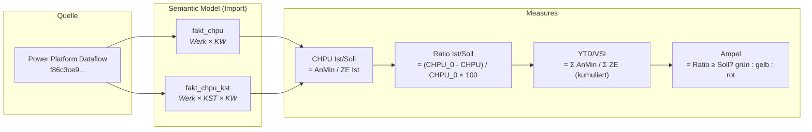

# C-HPU Datenmodell – Dokumentation

**Stand:** 10.06.2026  
**Quelle:** Power Platform Dataflows (Workspace `c5f886de-fae0-47a0-a39c-88802ced5740`, Dataflow `f86c3ce9-edc9-4f19-a809-f03028f2103b`)  
**Modell:** TMDL / Semantic Model (Import-Modus)  
**Kultur:** de-DE

---

## 1. Tabellenübersicht

| Tabelle | Granularität | Zweck | Zeilen (Testdaten) |
|---|---|---|---|
| `fakt_chpu` | 1 Zeile = 1 Werk × 1 KW | Werksebene (Cockpit, Entwicklung, Abweichung) | ~159 |
| `fakt_chpu_kst` | 1 Zeile = 1 Werk × 1 KST × 1 KW | Kostenstellenebene (Drill-Through) | n/a |

**Keine Beziehung** zwischen den beiden Tabellen. Sie werden getrennt abgefragt. Drill-Through-Filterung erfolgt über gleichnamige Felder (`source_plant_id`, `jahr_kw`).

---

## 2. Schlüsselfelder

| Feld | Typ | Beschreibung | Tabelle |
|---|---|---|---|
| `source_plant_id` | String | Werk-ID (z.B. `1300`, `1700`) | beide |
| `kst_bezeichnung_kurz` | String | Kurzbezeichnung Kostenstelle | nur `fakt_chpu_kst` |
| `jahr_kw` | Integer | Kalenderwoche im Format YYYYWW (z.B. `202620`) | beide |

### Jahr/KW-Extraktion (DAX)

```dax
-- Jahr
INT( jahr_kw / 100 )

-- KW
MOD( jahr_kw, 100 )
```

**Niemals** `LEFT()`, `MID()` oder `FORMAT()` für Jahr/KW verwenden.

### Datenumfang (Testdaten)

- **Werke:** 2 (`1300`, `1700`)
- **KW-Bereich:** 202501–202653
- Viele KWs für Werk 1700 sind leer (alle Werte = 0)
- Werk 1300 enthält ab ca. KW 2026xx echte Daten

---

## 3. Spaltenstruktur (identisch in beiden Tabellen)

### 3.1 Zieleinheiten

| Spalte | Typ | Aggregation | Beschreibung |
|---|---|---|---|
| `ze_ist` | Double | SUM | Zieleinheiten Ist (produzierte, normierte Leistung) |
| `ze_soll` | Double | SUM | Zieleinheiten Soll (geplant) |

**Wichtig:** `ze_ist` ≠ `ze_soll` — in den Testdaten weichen sie deutlich ab (z.B. 341.626 vs. 381.870 pro KW). Alle Soll-CHPU-Berechnungen müssen durch `ze_ist` geteilt werden.

### 3.2 Anwesenheitsminuten – Gesamt

| Spalte | Typ | Aggregation | Beschreibung |
|---|---|---|---|
| `anmin_ist` | Double | SUM | Anwesenheitsminuten Ist (Gesamt) |
| `anmin_soll` | Double | SUM | Anwesenheitsminuten Soll (mit Ratio-Ziel) |
| `anmin_soll_ohne_ratio` | Double | SUM | Anwesenheitsminuten Soll auf 0%-Linie (ohne Ratio-Einrechnung) |

### 3.3 Anwesenheitsminuten – nach Kategorie (Ist)

| Spalte | Typ | Beschreibung |
|---|---|---|
| `anmin_ist_d` | Double | AnMin Ist Direkt VBZ |
| `anmin_ist_di` | Double | AnMin Ist Direkt Indirekt / Direkt Fix |
| `anmin_ist_i` | Double | AnMin Ist Indirekt |
| `anmin_ist_d_di` | Double | AnMin Ist Direkt gesamt (= D + DI) |

#### Verifizierte Beziehungen

```
anmin_ist = anmin_ist_d + anmin_ist_di + anmin_ist_i          ✓ (auf Zeilenebene)
anmin_ist_d_di = anmin_ist_d + anmin_ist_di                    ✓ (auf Zeilenebene)
anmin_ist = anmin_ist_d_di + anmin_ist_i                       ✓ (auf Zeilenebene)
```

### 3.4 Anwesenheitsminuten – nach Kategorie (Soll)

| Spalte | Typ | Beschreibung |
|---|---|---|
| `anmin_soll_d` | Double | AnMin Soll Direkt VBZ |
| `anmin_soll_di` | Double | AnMin Soll Direkt Indirekt / Direkt Fix |
| `anmin_soll_i` | Double | AnMin Soll Indirekt |

#### Verifizierte Beziehung

```
anmin_soll = anmin_soll_d + anmin_soll_di + anmin_soll_i      ✓ (auf Zeilenebene)
```

### 3.5 Anwesenheitsminuten – nach Kategorie (Soll ohne Ratio)

| Spalte | Typ | Beschreibung |
|---|---|---|
| `anmin_soll_ohne_ratio_d` | Double | AnMin Soll 0% Direkt VBZ |
| `anmin_soll_ohne_ratio_di` | Double | AnMin Soll 0% Direkt Indirekt |
| `anmin_soll_ohne_ratio_i` | Double | AnMin Soll 0% Indirekt |

### 3.6 Vorberechnete Kennzahlen (Spalten)

| Spalte | Typ | Formel (verifiziert) | Skala |
|---|---|---|---|
| `chpu_ist` | Double | `anmin_ist / ze_ist` | min/ZE (z.B. 21.55) |
| `chpu_soll` | Double | `anmin_soll / ze_ist` | min/ZE (z.B. 17.45) |
| `chpu_soll_ohne_ratio` | Double | `anmin_soll_ohne_ratio / ze_ist` | min/ZE (z.B. 17.68) |
| `ratio_ist` | Double | `(chpu_0 - chpu_ist) / chpu_0 * 100` | **Prozentpunkte** (z.B. -21.91) |
| `ratio_soll` | Double | `(chpu_0 - chpu_soll) / chpu_0 * 100` | **Prozentpunkte** (z.B. 1.26) |

### 3.7 Ratio – nach Kategorie (nur Spalten)

| Spalte | Typ | Beschreibung |
|---|---|---|
| `ratio_ist_d` | Double | Ratio Ist Direkt VBZ |
| `ratio_ist_di` | Double | Ratio Ist Direkt Indirekt |
| `ratio_ist_i` | Double | Ratio Ist Indirekt |
| `ratio_soll_d` | Double | Ratio Soll Direkt VBZ |
| `ratio_soll_di` | Double | Ratio Soll Direkt Indirekt |
| `ratio_soll_i` | Double | Ratio Soll Indirekt |

### 3.8 CHPU – nach Kategorie (nur Spalten, nur `fakt_chpu_kst`)

| Spalte | Typ | Beschreibung |
|---|---|---|
| `chpu_ist_d` | Double | CHPU Ist Direkt |
| `chpu_ist_di` | Double | CHPU Ist Direkt Indirekt |
| `chpu_ist_i` | Double | CHPU Ist Indirekt |

---

## 4. Berechnungsregeln (verifiziert gegen Rohdaten)

### 4.1 CHPU

```
CHPU Ist  = AnMin Ist  / ZE Ist
CHPU Soll = AnMin Soll / ZE Ist        ← NICHT ZE Soll!
CHPU 0%   = AnMin Soll ohne Ratio / ZE Ist
```

**Warum ZE Ist?** Laut C-HPU-Regelwerk wird gefragt: „Wie viele Minuten wären für die tatsächlich erbrachte Leistung (ZE Ist) geplant gewesen?" Soll-Werte werden auf die Ist-Leistung bezogen.

### 4.2 Ratio

```
Ratio Ist  = (CHPU 0% - CHPU Ist)  / CHPU 0% × 100
Ratio Soll = (CHPU 0% - CHPU Soll) / CHPU 0% × 100
```

- **Ergebnis in Prozentpunkten** (z.B. 4.56 bedeutet 4,56%)
- Positiver Wert = Ist besser als 0%-Linie (gut)
- Negativer Wert = Ist schlechter als 0%-Linie (schlecht)
- `formatString: 0.00` (NICHT `0.00%` — das würde den Wert nochmal ×100 nehmen → 456%)

### 4.3 Ampellogik

| Bedingung | Ampel |
|---|---|
| `Ratio Ist ≥ Ratio Soll` | Grün (Ziel erreicht) |
| `Ratio Ist ≥ 0` | Gelb (Ratio erzielt, aber unter Ziel) |
| `Ratio Ist < 0` | Rot (kein Ratio erzielt) |

### 4.4 YTD

```
CHPU Ist YTD = Σ AnMin Ist (KW1..m) / Σ ZE Ist (KW1..m)
CHPU Soll YTD = Σ AnMin Soll (KW1..m) / Σ ZE Ist YTD    ← ZE Ist!
```

YTD-Filter: `INT(jahr_kw / 100) = aktuelles Jahr && jahr_kw <= max(jahr_kw)`

**Niemals** einzelne CHPU-Werte oder Ratios per AVERAGE aggregieren. Immer Summen bilden und dann teilen.

### 4.5 VSI (temporär)

```
VSI = YTD    (solange finale VSI-Logik nicht abgestimmt)
```

Zukünftige Formel:
```
CHPU VSI = (Σ AnMin Ist KW1..m + Σ AnMin Soll KW(m+1)..n) / (Σ ZE Ist KW1..m + Σ ZE Soll KW(m+1)..n)
```

---

## 5. Verbotene Aggregationen

| Verboten | Warum | Richtig |
|---|---|---|
| `SUM(chpu_ist)` | CHPU ist ein Verhältnis, nicht summierbar | `DIVIDE(SUM(anmin_ist), SUM(ze_ist))` |
| `SUM(ratio_ist)` | Ratio ist ein Verhältnis | `DIVIDE(CHPU_0 - CHPU_Ist, CHPU_0) * 100` |
| `AVERAGE(ratio_ist)` | Gewichtung fehlt, kleine Werke überrepräsentiert | CHPU-basierte Berechnung |
| `CHPU Soll / ZE Soll` | Falscher Bezug | `AnMin Soll / ZE Ist` |
| `LEFT(jahr_kw, 4)` | jahr_kw ist Integer | `INT(jahr_kw / 100)` |

---

## 6. Datenqualitäts-Hinweise

### 6.1 Leere Zeilen

Viele KWs (besonders für Werk 1700 und frühe KWs 2025) enthalten nur Nullwerte. Measures müssen BLANK() zurückgeben wenn `ZE Ist = 0`.

### 6.2 Differenz ZE Ist vs. ZE Soll

In den Testdaten weichen `ze_ist` und `ze_soll` **erheblich** voneinander ab:

```
Beispiel KW 202620, Werk 1300:
  ZE Ist:   341.625,85
  ZE Soll:  381.869,56
  Delta:   -40.243,71 (-10,5%)
```

Aggregiert über alle Daten:
```
  ZE Ist:    9.020.380
  ZE Soll:  20.326.637
  Delta:   -11.306.257
```

Die große Differenz auf Gesamtebene entsteht durch viele Zukunfts-KWs mit `ze_soll > 0` aber `ze_ist = 0`.

### 6.3 KW 202653

Die Daten enthalten KW 53 für 2026. Das Jahr 2026 hat nach ISO tatsächlich 53 KWs — daher plausibel.

---

## 7. Datenfluss-Diagramm



---

## 8. Spalten-Referenz kompakt

### `fakt_chpu` (Werksebene)

```
Schlüssel:     source_plant_id, jahr_kw
ZE:            ze_ist, ze_soll
AnMin Ges:     anmin_ist, anmin_soll, anmin_soll_ohne_ratio
AnMin Ist:     anmin_ist_d, anmin_ist_di, anmin_ist_i, anmin_ist_d_di
AnMin Soll:    anmin_soll_d, anmin_soll_di, anmin_soll_i
AnMin Soll 0%: anmin_soll_ohne_ratio_d, anmin_soll_ohne_ratio_di, anmin_soll_ohne_ratio_i
CHPU:          chpu_ist, chpu_soll, chpu_soll_ohne_ratio
Ratio:         ratio_ist, ratio_soll
Ratio Kat:     ratio_ist_d, ratio_ist_di, ratio_ist_i, ratio_soll_d, ratio_soll_di, ratio_soll_i
```

### `fakt_chpu_kst` (Kostenstellenebene)

```
Schlüssel:     source_plant_id, kst_bezeichnung_kurz, jahr_kw
ZE:            ze_ist, ze_soll
AnMin Ges:     anmin_ist, anmin_soll, anmin_soll_ohne_ratio
AnMin Ist:     anmin_ist_d, anmin_ist_di, anmin_ist_i, anmin_ist_d_di
AnMin Soll:    anmin_soll_d, anmin_soll_di, anmin_soll_i
AnMin Soll 0%: anmin_soll_ohne_ratio_d, anmin_soll_ohne_ratio_di, anmin_soll_ohne_ratio_i
CHPU:          chpu_ist, chpu_soll, chpu_soll_ohne_ratio
CHPU Kat:      chpu_ist_d, chpu_ist_di, chpu_ist_i
Ratio:         ratio_ist, ratio_soll
Ratio Kat:     ratio_ist_d, ratio_ist_di, ratio_ist_i, ratio_soll_d, ratio_soll_di, ratio_soll_i
```

---

## 9. Lessons Learned (Debug-Erkenntnisse)

1. **CHPU Soll muss durch ZE Ist geteilt werden**, nicht ZE Soll. Die vorberechneten Spalten `chpu_soll` und `chpu_soll_ohne_ratio` bestätigen das.

2. **Ratio wird in Prozentpunkten geliefert** (5.0 = 5%), nicht als Dezimal (0.05). DAX-Measures müssen `* 100` rechnen und `formatString: 0.00` verwenden.

3. **AnMin-basierte Ratio-Berechnung funktioniert nur**, wenn im Bruch `AnMin / ZE` überall dasselbe ZE steht. Bei aggregierten Daten mit unterschiedlichen ZE-Werten (Ist ≠ Soll) muss die CHPU-basierte Formel verwendet werden.

4. **Vorberechnete Spalten dürfen nicht aggregiert werden.** `SUM(chpu_ist)` oder `AVERAGE(ratio_ist)` erzeugt falsche Ergebnisse. Immer `DIVIDE(SUM(anmin), SUM(ze))` verwenden.

5. **Viele Zeilen sind leer** (alle Werte = 0). Measures müssen `BLANK()` zurückgeben statt durch 0 zu teilen.
